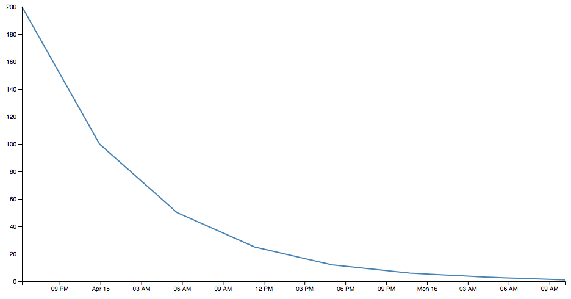

# caffgraph
This program consists of two components: 

1. a Go program that converts a timestamped dosage of caffeine to a list of estimates for how much remains in the system 
2. a D3.js page that visualizes in line graph form, from that Go output, how much caffeine is in the body at one time

It's currently in transition between the old csv format that could not easily account for additional dosing before the previous caffeine was previously flushed out; and a new json format that does.

## index.html
csv-prototyped graph:


## client
Adding the `-write` flag here would have written this output to the filesystem. Use the `-help` flag to see all options.
```
> go run dose.go halflife.go -time=2018-04-15T11:20:00Z -dosage=95
[
  {"name": "Americano",
   "dosage": 95,
   "time": "2018-04-15T11:20:00Z",
   "remnants": [
    {"time": "2018-04-15T11:20:00Z", "remnant": 47},
    {"time": "2018-04-15T17:02:00Z", "remnant": 23},
    {"time": "2018-04-15T22:44:00Z", "remnant": 11},
    {"time": "2018-04-16T04:26:00Z", "remnant": 5},
    {"time": "2018-04-16T10:08:00Z", "remnant": 2},
    {"time": "2018-04-16T15:50:00Z", "remnant": 1}
   ]
  }
]
```

## server
In `./server`, `go run *.go`, then navigate to `localhost:8080/doses` to see the two default doses. Then, run `curl -H "Content-Type: application/json" -d '{"name":"Americano","dosage":95,"time":"2018-04-15T11:20:00Z","remnants":[{"time":"2018-04-15T11:20:00Z","remnant":47},{"time":"2018-04-15T17:02:00Z","remnant":23},{"time":"2018-04-15T22:44:00Z","remnant":11},{"time":"2018-04-16T04:26:00Z","remnant":5},{"time":"2018-04-16T10:08:00Z","remnant":2},{"time":"2018-04-16T15:50:00Z","remnant":1}]}' http://localhost:8080/doses`. Refresh the `doses` page and it appears!
