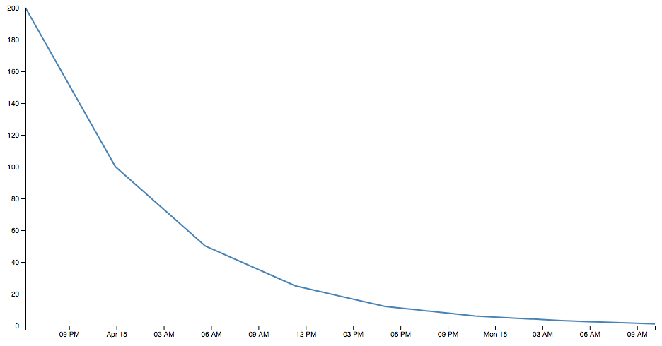

# caffgraph
This program consists of two components: 

1. a Go program that converts a timestamped dosage of caffeine to a list of estimates for how much remains in the system 
2. a D3.js page that visualizes in line graph form, from that Go output, how much caffeine is in the body at one time

Sample output:


# adding entries
`halflife` and the script in `index.html` use the [comma-separated value](https://en.wikipedia.org/wiki/Comma-separated_values) (csv) format to share data, and the [ISO 8601](https://en.wikipedia.org/wiki/ISO_8601) (`go`'s `time.RFC3339`) format for date/time values within the file. The `-write` switch writes to `caffeine.csv` instead of to stdout, as in the example:

```
> go run halflife.go
Enter time: 
Using default current time.
Enter mg: 
Using default 100mg.
date,close
2018-04-16T00:05:38Z,100
2018-04-16T05:47:38Z,50
2018-04-16T11:29:38Z,25
2018-04-16T17:11:38Z,12
2018-04-16T22:53:38Z,6
2018-04-17T04:35:38Z,3
2018-04-17T10:17:38Z,1
```

# future
1. csv -> JSON, to include `remnants` as an array inside `dosage`s (which have `name`s)
2. make halflife parameter more generic, to enable not just caff
3. go web server
